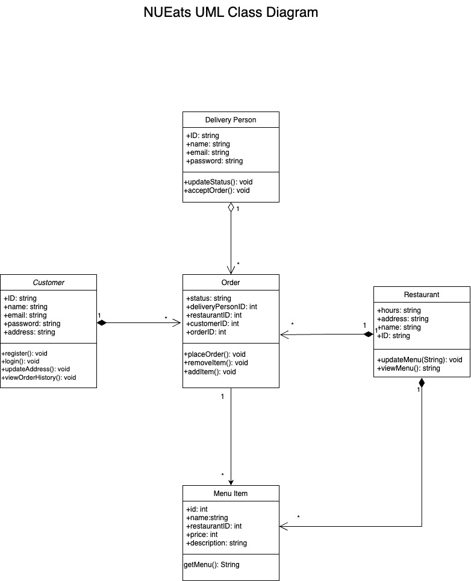

# NUEats

## Description: 
In this project, we aim to implement a food delivery application. Customers can place food orders from a variety of restaurants via this application. Restaurants can post updates to their menu to provide customers with the best options. 

## User stories
### As a user:
1) I want to register for an account and login

### As a customer:
2) I want to search for restaurants so that I can choose from the filters
3) I want to view the basic information of a restaurant so that I can know the distance from me and the operation time of the restaurant
4) I want to view the menu of a restaurant so that I can order from it
5) I want to add items to my cart and view it
6) I want to see my order’s status so that I can track it
7) I want to be able to view my order history 
8) I want to be able to rate a restaurant so that I can make other customer to be able to view the rating of the restaurant

### As a restaurant owner:
9) I want to be able to view, add, and update my menu

### As a delivery person:
10) I want to be able to accept orders
11) I want to be able to mark an order so that the customer can track the status of the order as: waiting for the restaurant; on the way; or delivered

## User Story Assign
Linwei Shao: User Story 1), 9), Web UIs
Sahithi Bommineni: User Story 2), 3), 4)
Shantanu Sachdeva: User Story 5), 7), 8)
Shunchang Yu: User Story 6), 10), 11)

### Milestone 1: Restaurant and Menu Management (Week 1)
- Develop a restaurant search and filtering system for customers (User Story 2)
- Implement the ability for restaurant owners to add, update, and manage their menus through updating the JSON file stores their menu (User Story 9)
- Develop a system for displaying restaurant information, such as location and operating hours, front-end design (User Story 3)

### Milestone 2: Ordering and Delivery Management (Week 2)
- Develop a shopping cart system and order placement process for customers (User Story 5)
- Implement the ability for customers to track their orders (User Story 6)
- Develop a system for delivery persons to accept and mark orders status (User Story 11)

### Milestone 3: Rating and Review System (week 3)
- Develop a rating and review system for customers to rate restaurants (User Story 8)
- Implement the ability for customers to view their order history (User Story 7)
- Develop a reporting system for tracking ratings and reviews (User Story 7)

### Milestone 4:  User Account Management (week 4)
- Develop a user registration and login system (MongoDB part) (User Story 1)
- Implement the ability for customers, restaurant owners, and delivery persons to create accounts and access their respective dashboards (User Story 1)

# Object Model

# spoonacular API
GET https://api.spoonacular.com/food/menuItems/search?apiKey=32cd012950b942f0a96979ed9318f9ac&query=burger&number=2

GET https://api.spoonacular.com/food/restaurants/search

